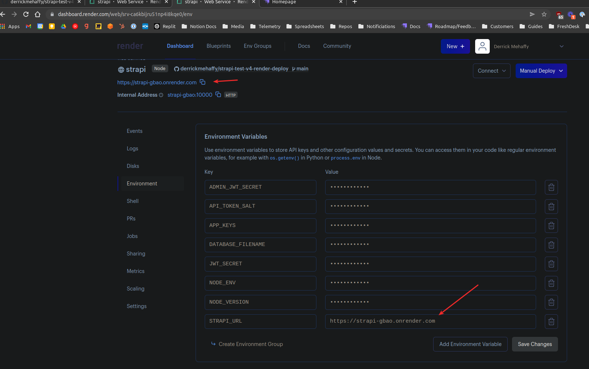

# Deploying Strapi v4 on Render

You need to make sure you set the server URL in the environment variables.

You also need to add the production server URL, you can see an example in [./config/env/production/server.js](config/env/production/server.js)
